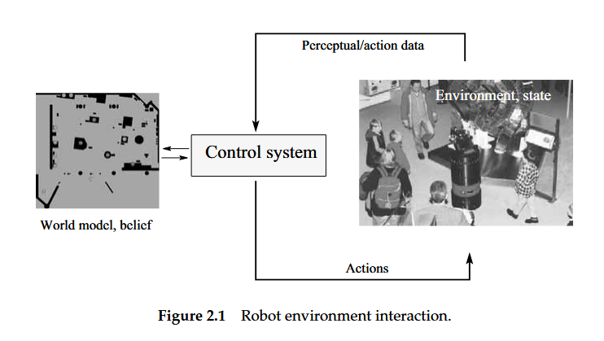
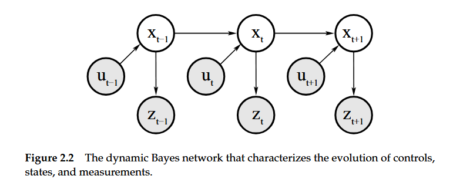

# Probabilistic Robotics — Ch. 2: Recursive State Estimation

---
## Core Idea
> Robots can't directly measure the world. They must **infer** hidden state from noisy sensors and imperfect actuators. Probabilistic state estimation does this by computing **distributions over possible states**, not single guesses.
---
## Key Vocabulary

| Term                         | Meaning                                                                         |
| ---------------------------- | ------------------------------------------------------------------------------- |
| **State** $x_t$              | Everything relevant about the robot & environment at time $t$                   |
| **Complete State**           | A state where knowing $x_t$ makes the past irrelevant for predicting the future |
| **Belief** $\text{bel}(x_t)$ | The robot's internal posterior distribution over state                          |
| **Measurement** $z_t$        | Sensor reading at time $t$ — noisy projection of state                          |
| **Control** $u_t$            | Action / odometry at time $t$ — conveys change of state                         |
| **Prior** $p(x)$             | Belief _before_ incorporating data                                              |
| **Posterior** $p(x \mid y)$  | Belief _after_ incorporating data $y$                                           |

---
## Probability Essentials
### Bayes Rule
$$p(x \mid y) = \frac{p(y \mid x), p(x)}{p(y)} = \eta; p(y \mid x); p(x)$$
- $p(x)$ — **prior**: what we knew before
- $p(y \mid x)$ — **generative model / likelihood**: how state causes measurements
- $p(x \mid y)$ — **posterior**: updated belief after seeing data
- $\eta$ — normalizer (makes it sum/integrate to 1), not a function of $x$
### Total Probability
$$p(x) = \int p(x \mid y), p(y), dy$$
### Conditional Independence
$$p(x, y \mid z) = p(x \mid z), p(y \mid z)$$
Knowing $z$ makes $x$ and $y$ independent — **crucial** for tractability in robotics.

> [!warning] Independence ≠ Conditional Independence — the two directions don't imply each other in general.

### Gaussian Distributions
**Univariate:** $$p(x) = \frac{1}{\sqrt{2\pi\sigma^2}} \exp!\left(-\frac{(x-\mu)^2}{2\sigma^2}\right) = \mathcal{N}(x;\ \mu,\ \sigma^2)$$
**Multivariate:** $$p(\mathbf{x}) = \frac{1}{\sqrt{|2\pi\Sigma|}} \exp!\left(-\frac{1}{2}(\mathbf{x}-\boldsymbol{\mu})^T \Sigma^{-1} (\mathbf{x}-\boldsymbol{\mu})\right) = \mathcal{N}(\mathbf{x};\ \boldsymbol{\mu},\ \Sigma)$$
- $\boldsymbol{\mu}$ = mean vector, $\Sigma$ = covariance matrix (pos. semidefinite, symmetric)
### Expectation & Covariance
$$E[X] = \int x, p(x), dx$$
$$\text{Cov}[X] = E!\left[(X - E[X])^2\right] = E[X^2] - (E[X])^2$$
### Entropy
$$H_{p(x)} = -\int p(x) \log_2 p(x), dx$$

> Measures **expected information**, higher entropy = more uncertainty.

---
### Two Probabilistic Laws

#### State Transition (Motion Model)
$$p(x_t \mid x_{t-1},, u_t)$$
- How the world evolves under control $u_t$
- Used in the **prediction step**
- Stochastic, motion is noisy
#### Measurement Model (Observation Model)
$$p(z_t \mid x_t)$$
- What sensor reading to expect given state $x_t$
- Used in the **correction step**
- Treats measurement as a noisy projection of state

> [!note] These two laws, together with an initial belief $p(x_0)$, fully define the system. This structure is a **Hidden Markov Model (HMM)** / **Dynamic Bayes Network (DBN)**.

---
## The Markov Assumption

> If $x_t$ is **complete**, then knowing it makes all past data irrelevant:
$$p(x_t \mid x_{0:t-1},\ z_{1:t-1},\ u_{1:t}) = p(x_t \mid x_{t-1},\ u_t)$$
$$p(z_t \mid x_{0:t},\ z_{1:t-1},\ u_{1:t}) = p(z_t \mid x_t)$$
This is the **Markov assumption** — it's what makes recursive filtering tractable.

> [!warning] Violations of Markov in practice:
> 
> - Unmodeled dynamics (e.g. moving people)
> - Inaccurate probabilistic models
> - Approximate belief representations (grids, Gaussians)
> - Shared software variables across time steps
> 
> Despite this, Bayes filters are surprisingly robust.

---
## Belief
The robot's belief at time $t$ is the posterior over state given all data so far:
$$\text{bel}(x_t) = p(x_t \mid z_{1:t},, u_{1:t})$$

The **predicted belief** (before incorporating $z_t$):
$$\overline{\text{bel}}(x_t) = p(x_t \mid z_{1:t-1},, u_{1:t})$$
---
## The Bayes Filter
The general recursive algorithm for computing beliefs:

```cpp
// Bayes Filter — one iteration
// bel_prev : belief at t-1 (discrete distribution over states)
// u        : control at time t
// z        : measurement at time t
// returns  : updated belief at time t

std::vector<double> bayes_filter(
    const std::vector<double>& bel_prev,
    int u, int z,
    const std::vector<std::vector<double>>& p_transition,  // p(x_t | x_{t-1}, u)
    const std::vector<double>& p_measurement               // p(z | x_t)
) {
    int n = bel_prev.size();
    std::vector<double> bel_bar(n, 0.0);  // predicted belief
    std::vector<double> bel(n, 0.0);      // corrected belief

    // --- Prediction step ---
    for (int xt = 0; xt < n; ++xt)
        for (int xt_prev = 0; xt_prev < n; ++xt_prev)
            bel_bar[xt] += p_transition[xt][xt_prev] * bel_prev[xt_prev];

    // --- Correction step ---
    double eta = 0.0;
    for (int xt = 0; xt < n; ++xt) {
        bel[xt] = p_measurement[xt] * bel_bar[xt];
        eta += bel[xt];
    }

    // --- Normalize ---
    for (int xt = 0; xt < n; ++xt)
        bel[xt] /= eta;

    return bel;
}
```
### Step 1: Prediction (Control Update)
$$\overline{\text{bel}}(x_t) = \int p(x_t \mid u_t,\ x_{t-1}); \text{bel}(x_{t-1}); dx_{t-1}$$ Propagates prior belief through the motion model → uncertainty **grows**.
### Step 2 — Correction (Measurement Update)
$$\text{bel}(x_t) = \eta; p(z_t \mid x_t); \overline{\text{bel}}(x_t)$$ Weights each hypothesis by how well it explains the measurement → uncertainty **shrinks**.

> [!tip] Intuition: Prediction spreads the distribution (motion adds noise). Correction sharpens it (sensor data gives information). They trade off in every step.
### Initialization
- **Known start:** point mass at $x_0$
- **Unknown start:** uniform distribution over state space
---
## Worked Example — Door State Estimation
Robot doesn't know if door is open or closed. Sensor is noisy.
**Setup:**

|                | sense_open | sense_closed |
| -------------- | ---------- | ------------ |
| door is_open   | 0.6        | 0.4          |
| door is_closed | 0.2        | 0.8          |

**After $u_1 =$ do_nothing, $z_1 =$ sense_open:**
$$\overline{\text{bel}}(X_1 = \text{open}) = 0.5, \qquad \overline{\text{bel}}(X_1 = \text{closed}) = 0.5$$ $$\text{bel}(X_1 = \text{open}) = \eta \cdot 0.6 \cdot 0.5 = \eta \cdot 0.3$$ $$\text{bel}(X_1 = \text{closed}) = \eta \cdot 0.2 \cdot 0.5 = \eta \cdot 0.1 \implies \eta = 2.5$$ $$\boxed{\text{bel}(X_1 = \text{open}) = 0.75}$$**After $u_2 =$ push, $z_2 =$ sense_open:** $$\overline{\text{bel}}(X_2 = \text{open}) = 1 \cdot 0.75 + 0.8 \cdot 0.25 = 0.95$$$$\boxed{\text{bel}(X_2 = \text{open}) \approx 0.983}$$
> [!warning] Even at 0.983 confidence, don't discard the other hypothesis — a wrong decision with a closed door could be costly. Always use the **full distribution** for decision-making.

---

## Approximation Strategies
Exact Bayes filtering is generally **intractable**. Practical implementations approximate:

|Approach|Representation|Strengths|Weaknesses|
|---|---|---|---|
|**Kalman Filter**|Gaussian ($\mu$, $\Sigma$)|Fast, closed-form|Unimodal, needs linear/Gaussian models|
|**Particle Filter**|$N$ weighted samples|Multi-modal, nonlinear|Computationally heavy|
|**Histogram Filter**|Discrete grid|Multi-modal|Memory intensive, fixed resolution|

**Trade-offs when choosing:**
1. **Computational efficiency** — polynomial vs exponential in state dimension
2. **Approximation accuracy** — unimodal vs multi-modal support
3. **Ease of implementation** — particle filters are often simplest for nonlinear systems

---
## DBN Graphical Model



- $x_t$ depends on $x_{t-1}$ and $u_t$ → **motion model**
- $z_t$ depends only on $x_t$ → **measurement model**
- $m$ (map) can be added as a parent of $z_t$ for SLAM
---
## Summary in One Line

> Bayes filter = **predict** with motion model + **correct** with sensor model, repeated recursively, to maintain a belief distribution over hidden state.

---

_Based on Thrun, Burgard, Fox — Probabilistic Robotics, Chapter 2_